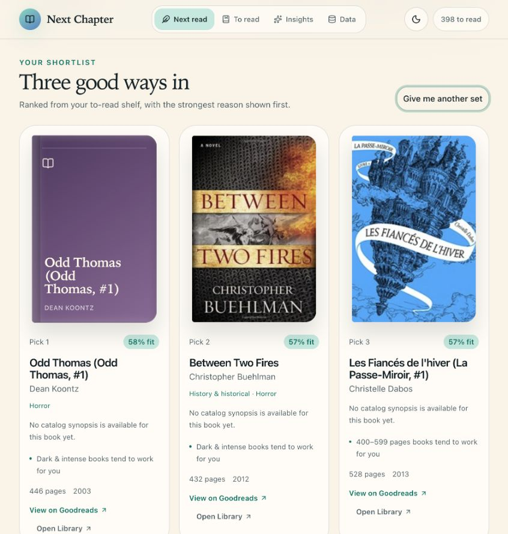

# Next Chapter

### Less scrolling. More reading.

Next Chapter turns an overflowing Goodreads shelf into three thoughtful choices
for what to read next. Choose the kind of book you want, see why each title
fits, and start a new chapter without spending the evening comparing hundreds
of options.

## Find the right book for right now

Tell Next Chapter what kind of reading experience you want:

- choose a book category;
- pick a comfortable length;
- stay close to your usual taste or explore something less familiar.

You receive three clear suggestions from your own to-read shelf. Each one comes
with its cover, a short synopsis, useful details, and a simple explanation of
why it was selected.

Prefer not to choose? **Safe pick**, **Hidden gem**, and **Wildcard** offer three
different ways to be surprised.

## Made around your reading life

Next Chapter helps you:

- browse the books already waiting on your shelf;
- continue a series in order without being sent several volumes ahead;
- correct a missing cover, synopsis, or book detail;
- revisit every book you finished during a particular year;
- create and reorder a personal ranking of your finished books;
- switch between a warm light mode and a quiet dark mode.

## Your story compass

The reader profile looks beyond labels and names. It explores what actually
makes a story work for you: the pressure placed on its characters, the scale of
its world, the consequences of its ideas, the role of relationships, and the
balance between intimacy and momentum.

It describes your ideal reading experience, the narrative elements that pull
you in, and the themes that work better as supporting threads than as the whole
story.

## Bring in your Goodreads library

1. Open [Goodreads Import and export](https://www.goodreads.com/review/import).
2. Choose **Export Library**.
3. In Next Chapter, open **Data** and choose **Import Goodreads CSV**.
4. Select the downloaded `goodreads_library_export.csv` file.

Your reading dates, ratings, shelves, and reviews remain unchanged on
Goodreads. Importing a newer file simply refreshes the copy used by Next
Chapter.

## Your library stays yours

There is no Next Chapter account, advertising, or social feed. Your reading
library stays on your device, and the app never changes your Goodreads account.

Use **Download backup** before clearing browser data or moving to another
device. That backup can be restored from the Data page whenever you need it.

---

Next Chapter is an independent personal project. Goodreads remains the source
of truth for reading activity and does not endorse this app.
